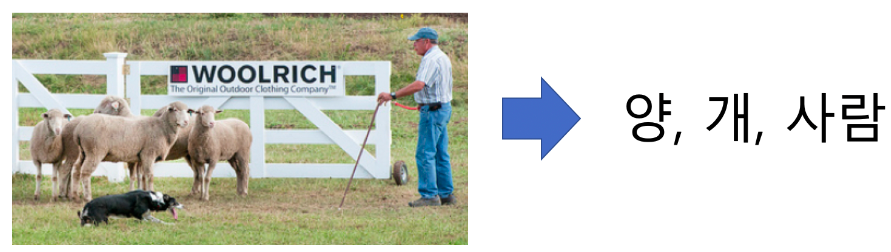
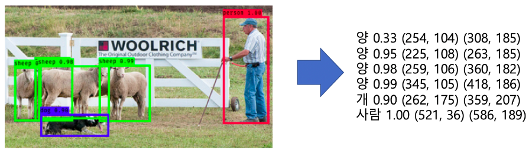
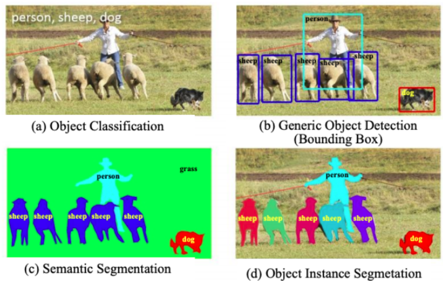

# Object Detection

다음 2가지 작업을 실행

- 물체의 위치를 탐지(localization)
- 물체를 분류(classification)

물체 분류는 제시된 영상에 특정 대상의 유무를 판단하는 작업

물체 탐지는 특정 대상의 위치와 대상을 판단한는 작업

이외에 다른 작업들도 있다.

 

# 모델들

YOLO, SSD의 모델이 많이 사용된다.

- 실습자료 : [object_detection_yolo_and_ssd.ipynb](deep_learning/object_detection_yolo_and_ssd.ipynb)
