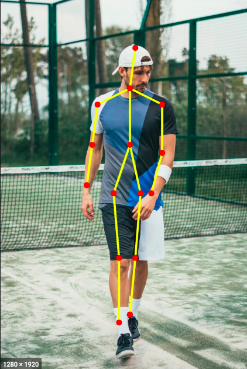

# 실무과제 - Pose Estimtation

사람이 포함된 이미지에서 사람의 포즈를 추출하는 작업

OpenPose를 사용.

웹캠에서 받은 동영상을 Colab에 전달하여 포즈추출을 하고
그 결과를 다시 Colab화면으로 보여준다.

실습 자료 : [pose_estimation_with_webcam.ipynb](deep_learning/pose_estimation_with_webcam.ipynb)